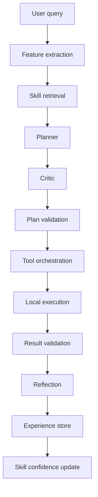

# InsightFlow Secure Excel Mode

This project has been updated to support an Excel-only, privacy-first workflow.
The default path keeps the workbook, schema, row values, and all column
semantics local to the backend process.

## 1. How the architecture works

The secure pipeline is:

1. Excel file upload
2. Local Python processing
3. Local workbook scanning with `openpyxl`
4. Local schema and semantic role detection
5. Local anonymization of columns to `c1`, `c2`, `c3`, ...
6. Local natural-language parsing into a structured query
7. Optional remote AI only for anonymized, controlled JSON if explicitly enabled
8. Local validation
9. Local execution against the original pandas DataFrame
10. Local response rendering

## 2. What data stays local

The following never need to leave the machine:

- actual column names
- row values
- cell values
- filenames
- sheet names
- business names
- customer names
- restaurant names
- addresses
- emails
- phone numbers
- URLs
- IDs
- any identifiable business information

The original pandas DataFrame stays in memory inside the backend session store.

## 3. What, if anything, is sent to the remote LLM

By default, nothing is sent to a remote LLM.

If remote AI is ever enabled through configuration, the payload must be restricted
to anonymized metadata and controlled query JSON only. The privacy guard blocks
payloads that contain obvious PII or raw workbook content.

## 4. How column anonymization works

Each Excel column is mapped locally to an internal ID:

- `c1`
- `c2`
- `c3`
- `c4`
- ...

That mapping is stored only in the backend session and never exposed to a remote model.

## 5. How semantic roles are detected

The backend infers a local semantic role for each column using:

- column-name hints
- dtype hints
- value-shape heuristics
- uniqueness patterns

Supported roles include:

- `identifier`
- `entity_name`
- `geographic_area`
- `rating_metric`
- `date`
- `numeric_metric`
- `currency_metric`
- `boolean_capability`
- `category`
- `email`
- `phone`
- `address`
- `url`
- `description`
- `status`
- `count`
- `percentage`
- `unknown`

Domain-specific roles such as `restaurant_entity`, `delivery_capability`, and
`table_booking_capability` are also detected locally.

## 6. How queries are converted into structured commands

Natural-language queries are parsed locally into a controlled JSON structure
containing:

- `operation`
- `conditions`
- `sort`
- `group_by`
- `aggregates`
- `limit`
- `search`
- `report`

Example:

```json
{
  "operation": "filter",
  "conditions": [
    { "column_id": "c3", "operator": "equals", "value": "Kolkata" },
    { "column_id": "c6", "operator": "equals", "value": true }
  ]
}
```

## 7. How local execution works

The backend validates the structured query, maps `cN` IDs back to the local
DataFrame columns, and executes only predefined operations such as filtering,
sorting, counting, grouping, aggregation, and reporting.

No arbitrary Python from an LLM is executed.

## 8. How to run the backend

Use the bundled Python runtime or your own Python environment.

```bash
python -m uvicorn main:app --host 127.0.0.1 --port 8000
```

Key endpoints:

- `GET /ping`
- `GET /powerbi/ping`
- `GET /powerbi/transform/list`
- `GET /excel/ping`
- `POST /excel/session`
- `POST /excel/query`
- `POST /excel/interpret`

## 9. How to configure the API

Configuration is environment-variable driven.

Useful variables:

- `SECURE_EXCEL_REMOTE_AI=false`
- `SECURE_EXCEL_REMOTE_AI_PROVIDER=gemini`
- `SECURE_EXCEL_MAX_PREVIEW_ROWS=25`

If `SECURE_EXCEL_REMOTE_AI` is left at the default `false`, the secure Excel
path remains local-only.

## 10. How to disable remote AI completely

Leave `SECURE_EXCEL_REMOTE_AI=false`.

That keeps the secure Excel routes local-only and prevents outbound remote
planning calls.

## Files added for the secure path

- [main.py](./main.py)
- [secure_excel/privacy_guard.py](./secure_excel/privacy_guard.py)
- [secure_excel/semantic_roles.py](./secure_excel/semantic_roles.py)
- [secure_excel/query_parser.py](./secure_excel/query_parser.py)
- [secure_excel/query_validator.py](./secure_excel/query_validator.py)
- [secure_excel/executor.py](./secure_excel/executor.py)
- [secure_excel/service.py](./secure_excel/service.py)
- [secure_excel/routes.py](./secure_excel/routes.py)
- [frontend/index.html](./frontend/index.html)
- [frontend/app.js](./frontend/app.js)
- [frontend/styles.css](./frontend/styles.css)

## 11. Self-learning analytics layer

The `agent/` and `learning/` packages add a privacy-safe learning loop on top
of the existing deterministic tools.

What it means:

- The system bootstraps structured skills from the expert code already in this repo.
- Successful executions become experiences that can be retrieved later.
- Repeated success raises skill confidence and can promote a skill from bootstrap
  to candidate or promoted state.
- The planner still prefers local deterministic tools and only falls back to the
  remote model when no learned skill is confident enough.

What it does not mean:

- No foundation model is trained from scratch.
- No runtime request edits source code or deploys itself.
- No raw workbook rows are written into the learning store.

Lifecycle:



Memory and promotion:

- Experiences are written to a local append-only JSONL log.
- Skill confidence is stored separately as versioned JSON state.
- Promotion happens only after repeated successful, validated use.
- Demotion happens when a skill repeatedly fails.

Privacy:

- Raw workbook values are never stored in the experience log.
- Only safe summaries, plan metadata, confidence values, and hashed schema
  signatures are retained.
- The remote LLM boundary stays the same as before: it is only used when the
  local planner cannot confidently resolve the request.

How to reset learning state:

- Delete the local learning state directory shown in the app configuration
  or set `DATA_ANALYSIS_LLM_STATE_DIR` to a fresh path.

