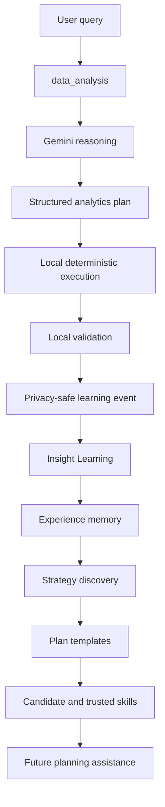

# Insight Learning

Insight Learning is a privacy-first, self-learning analytics intelligence service.
It learns from validated analytics experiences, stores only generalized and
sanitized learning memory, and uses that memory to improve future planning.

## What this service does

- Accepts privacy-safe learning events from the analytics app
- Builds reusable plan templates from validated experiences
- Promotes repeated patterns into candidate and trusted learned skills
- Returns safe, local plans before any remote reasoning is needed
- Keeps raw workbook data, raw prompts, and raw result rows out of learning memory

## Teacher / student architecture

The teacher is the existing `data_analysis` application. It already performs the
deterministic analytics execution and, when needed, uses Gemini as the reasoner.

The student is this repository:

- `data_analysis` reasons and executes
- `Insight Learning` stores the generalized, privacy-safe experience
- future plans can use learned templates and skills before Gemini is consulted



## Learning lifecycle

- `observed`: a repeated pattern has been seen but not promoted
- `candidate`: at least a few compatible successful examples exist
- `validated`: the pattern has enough successful support and quality
- `trusted`: the pattern is stable, high quality, and repeatedly safe
- `demoted`: repeated failures have pushed the skill down
- `deprecated`: reserved for future archival workflows

## Privacy

The learner never needs:

- raw queries
- raw workbook rows
- sheet names
- filenames
- customer names
- account IDs
- email addresses
- phone numbers
- financial records

Only generalized structure is persisted:

- intent
- predicate shape
- semantic roles
- operators
- tool sequence
- validation outcome
- quality score

## API

- `GET /v1/health`
- `POST /v1/plan`
- `POST /v1/experience`
- `POST /v1/feedback`
- `GET /v1/skills`
- `GET /v1/metrics`

## Local development

```bash
python -m pip install -e .[dev]
python -m pytest -q
uvicorn insight_learning.api.app:app --reload
```

## Integration contract

The teacher app can call the student like this:

1. try `POST /v1/plan` with safe semantic metadata
2. if the learned plan is high confidence, use it
3. otherwise let Gemini produce the plan
4. execute locally
5. send the safe validated experience to `POST /v1/experience`

## Future fine-tuning

No model fine-tuning happens yet. The codebase includes a dataset export path
for trusted, privacy-safe examples that can be used later.

