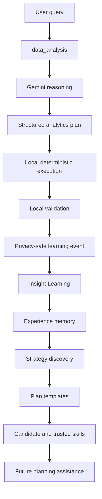

# Insight Learning

Insight Learning is a privacy-first, self-learning analytics intelligence service.
It learns from validated analytics experiences, stores only generalized and
sanitized learning memory, and uses that memory to improve future planning.

## What this service does

- Accepts privacy-safe learning events from the analytics app
- Builds reusable plan templates from validated experiences
- Promotes repeated patterns into candidate and trusted learned skills
- Returns safe, local plans before any remote reasoning is needed
- Keeps raw workbook data, raw prompts, and raw result rows out of learning memory

## Teacher / student architecture

The teacher is the existing `data_analysis` application. It already performs the
deterministic analytics execution and, when needed, uses Gemini as the reasoner.

The student is this repository:

- `data_analysis` reasons and executes
- `Insight Learning` stores the generalized, privacy-safe experience
- future plans can use learned templates and skills before Gemini is consulted



## Learning lifecycle

- `observed`: a repeated pattern has been seen but not promoted
- `candidate`: at least a few compatible successful examples exist
- `validated`: the pattern has enough successful support and quality
- `trusted`: the pattern is stable, high quality, and repeatedly safe
- `demoted`: repeated failures have pushed the skill down
- `deprecated`: reserved for future archival workflows

## Privacy

The learner never needs:

- raw queries
- raw workbook rows
- sheet names
- filenames
- customer names
- account IDs
- email addresses
- phone numbers
- financial records

Only generalized structure is persisted:

- intent
- predicate shape
- semantic roles
- operators
- tool sequence
- validation outcome
- quality score

## API

- `GET /v1/health`
- `POST /v1/plan`
- `POST /v1/experience`
- `POST /v1/feedback`
- `GET /v1/skills`
- `GET /v1/export/training-dataset`
- `GET /v1/metrics`

## Local development

```bash
python -m pip install -e .[dev]
python -m pytest -q
uvicorn insight_learning.api.app:app --reload
```

## Integration contract

The teacher app can call the student like this:

1. try `POST /v1/plan` with safe semantic metadata
2. if the learned plan is high confidence, use it
3. otherwise let Gemini produce the plan
4. execute locally
5. send the safe validated experience to `POST /v1/experience`

## Future fine-tuning

Every validated interaction can contribute to continual learning.

Not every interaction becomes fine-tuning data.

Only high-quality, validator-approved, privacy-safe, deduplicated examples
qualify for future fine-tuning. The repository includes a strict export path
for those examples, but no model fine-tuning happens yet.

### Training eligibility gate

An example must satisfy the full gate before export:

- execution success
- critic pass
- result validation pass
- plan completeness pass
- privacy validation pass
- no unresolved ambiguity
- no critical repair
- minimum quality threshold of `0.95`

Unknown or missing validation evidence makes the example ineligible.

### Export and local files

The export API supports:

- `GET /v1/export/training-dataset?format=report`
- `GET /v1/export/training-dataset?format=json`
- `GET /v1/export/training-dataset?format=jsonl`
- `GET /v1/export/training-dataset?format=csv`
- `GET /v1/export/training-dataset?format=manifest`
- `GET /v1/export/training-dataset?format=readiness`
- `POST /v1/export/training-dataset/create`
- `POST /v1/export/training-dataset/invalidate`

The service can also write local training files under `runtime/training/`:

- `train.jsonl`
- `validation.jsonl`
- `test.jsonl`
- `dataset_report.json`
- `dataset_manifest.json`

Those files are ignored by Git and are not committed.

### Deduplication, splitting, and privacy

- Export deduplicates by structural fingerprint, not raw query text.
- Structurally related examples stay in the same train/validation/test split.
- Default splitting is 80/10/10.
- The privacy validator rejects any example that still contains unsafe payloads after sanitization.
- Unsafe or repaired examples are rejected instead of being "best effort" exported.
- Invalidated source events or strategy families are excluded before export.
- The manifest captures a versioned summary plus readiness status for the canonical corpus.

### Curriculum harness

The repository also includes a local curriculum runner that seeds safe training
memory, validates the teacher/student bridge, and writes a report plus export
artifacts:

```bash
python curriculum/analytics_curriculum.py
```

It writes the following local outputs by default:

- `runtime/curriculum/report.json`
- `docs/analytics_curriculum_report.md`
- `runtime/training/train.jsonl`
- `runtime/training/validation.jsonl`
- `runtime/training/test.jsonl`
- `runtime/training/dataset_report.json`
- `runtime/training/dataset_manifest.json`

The runner keeps all generated artifacts local and privacy-safe, and it does not
perform model fine-tuning.

## Repository boundary audit

Only generalized metadata crosses from the teacher app into this repository:

- sanitized natural-language intent
- aliased field IDs
- semantic roles and dtypes
- structured query features
- plan summaries and validation outcomes

The following never need to cross the boundary:

- workbook rows or cell values
- filenames, sheet names, or file bytes
- customer names, emails, phone numbers, or account IDs
- raw free-form result tables
- any other row-level business data
